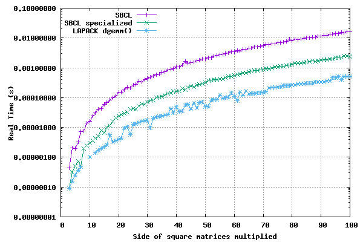

# Calling LAPACK/BLAS in SBCL
We provide an example of calling the foreign LAPACK/BLAS library in SBCL.
All credit for this example goes to this SO poster [1] and the source he cites
(which I was not able to exactly pinpoint).
This example is about the matrix multiplication `dgemm()` [2].

## Pre-requisites
You need to install LAPACK of course. There is a `lapack` package in the Void
Linux repository:

```shell
sudo xbps-install -S lapack
```

There should be a similar package for the distribution you use.

## General guide
Find the LAPACK function that you want to use. For `dgemm`, the documentation is
here [2].

We then need to build the SBCL alien routine [3], looking carefully at the
argument types the function requires and how they will be passed from Lisp.
See `define-alien-routine` in the SBCL manual.

```common-lisp
(define-alien-routine ("dgemm_" dgemm) void
  (transa c-string)
  (transb c-string)
  (m int :copy)
  (n int :copy)
  (k int :copy)
  (alpha double :copy)
  (a (* double))
  (lda int :copy)
  (b (* double))
  (ldb int :copy)
  (beta double :copy)
  (c (* double))
  (ldc int :copy))
```

The `:copy` is necessary, otherwise you would get an unhandled memory error
(not exactly sure why that is the case though).

Some data marshalling is needed:

```common-lisp
(defun pointer (array)
  (sap-alien (sb-sys:vector-sap (array-storage-vector array)) (* double)))
```

- `array-storage-vector` [sb-ext]: "Returns the underlying storage vector of
array, which must be a non-displaced array." - SBCL manual
- `sb-sys:vector-sap`: Transforms the lisp array into a SAP
(System Area Pointer).
- `sap-alien` [sb-alien]: "The sb-alien:sap-alien macro converts sap 
(a system area pointer) to a foreign value with the specified type. 
type is not evaluated. The type must be some foreign pointer, array, or 
record type." - SBCL Manual

We can now perform the actual call.

```common-lisp
(let ((a (make-array '(2 3) :element-type 'double-float
			    :initial-contents '((2d0 1d0 6d0) (7d0 3d0 4d0))))
      (b (make-array '(3 2) :element-type 'double-float
			    :initial-contents '((3d0 1d0) (6d0 5d0) (2d0 3d0))))
      (c (make-array '(2 2) :element-type 'double-float))
      (expected-c (make-array '(2 2) :element-type 'double-float
			      :initial-contents '((24d0 25d0) (47d0 34d0)))))
  (sb-sys:with-pinned-objects (a b c)
    (dgemm "n" "n" 2 2 3 1d0 (pointer b) 2 (pointer a) 3 0d0 (pointer c) 2))
  (format t "~A~%~A~%" expected-c c))
;; => #2A((24.0d0 25.0d0) (47.0d0 34.0d0))
;;    #2A((24.0d0 25.0d0) (47.0d0 34.0d0)) 
```

Note:
- `sb-sys:with-pinned-objects` forbids the garbage collector from moving around
the indicated objects in memory.
- The matrices in LAPACK are in column-major order while the Common-Lisp
matrices are in row-major order. They are transpositions of each other. Since,
for the operation *C = A.B*, *Trans(B).Trans(A) = Trans(A.B) = Trans(C)*, we can
perform the multiplication by feeding the matrices A and B in reverse order. We
avoid having to transpose the matrices ourselves in this case.

## Benchmarking
Let us compare the speed of three implementations of matrix multiplication:
1. SBCL without optimizations.
1. SBCL with optimizations.
1. LAPACK `dgemm()`.

We plot the time it takes to multiply two n by n matrices, as a function of n.
Please note the logscale on the y axis.



The results are unsurprising, LAPACK is pretty fast. Of course, if all you have
to perform are 3x3 or 4x4 matrix multiplications then you're probably better off
not using LAPACK.

## References
1. https://stackoverflow.com/questions/29822509/matrix-multiplication-using-blas-from-common-lisp
1. http://www.netlib.org/lapack/explore-html/d1/d54/group__double__blas__level3_gaeda3cbd99c8fb834a60a6412878226e1.html#gaeda3cbd99c8fb834a60a6412878226e1
1. http://www.sbcl.org/manual/#The-define_002dalien_002droutine-Macro
